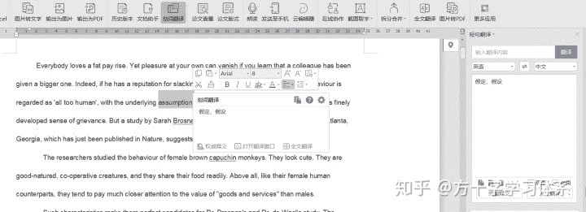

# 一个简单的应试英语（阅读，单词）学习方法［应试方法论］

> 原文：[https://zhuanlan.zhihu.com/p/97428560](https://zhuanlan.zhihu.com/p/97428560)

面向国内的应试英语学习，以阅读和写作为主。写作涉及的单词，句法，模板相对固定，本文不讨论。本文主要针对英语阅读，围绕应试英语阅读提出一些简单的思路和体系。

传统的英语阅读训练，其流程大致是首先记忆单词，然后学习语法（在语法有一定基础的前提下可以跳过这一步），最后开始阅读训练。记忆单词的方法，多是以不断的阅读，机械记忆。

在过去，采取这样的学习流程是有依据的。因为过去只能通过纸质的字典查单词。**通过纸质字典熟练完成单词查询大概需要30秒~1分钟，即使电子词典存在，单词的查询时间也在10到20秒之间**。在存在大量生词的前提下阅读效率极低。所以将单词集中记忆是一个相对高效的学习流程。

如果不考虑实际情况，**假如我们可以迅速查询生词的词义，那么通过查询词义→纳入句子理解单词这一流程，其对单词的学习效果一定是优于机械记忆的。获得关于单词的信息→理解单词的意思→在文中应用单词词义→多次应用，复习达成被动记忆，其记忆效果是舒适而深刻的。**

应用这一流程，其核心，在于“**查单词的速度**”。

在介绍方法之前，我要**批判两个相对低效的观念**。

观念一，有的老师试图让学生回归纸质词典查单词，其理由是通过纸质词典查单词印象比较深刻。

观念一的问题在于，学生面临的生词不仅仅是一个，而是大量的生词。若每个生词都采用这种方式处理，那么相同时间内相比使用更先进的查询工具而言学习的生词量将大大减小，学习进度严重拖慢，总体上得不偿失。而且，记忆的关键并不在于单次记忆时间有多长，而是是否保持科学合理的复习频率。

观念二，很多老师提出，做阅读的时候遇见生词不要去查，而是去猜词。

观念二有两个问题，问题一在于，猜词本质上属于应试技巧。当专门训练应试技巧时，我们就应该像考试一样去练习。但我们目前的目的，是为了学习单词，熟悉句法。当两个目的的训练方式存在冲突时，我们应该把两个训练分开进行，而不是混为一谈，相互掣肘。问题二在于，很多学生生词量过大，真的难以将全部生词猜出。猜词应该是建立在大多数单词以认识的基础上进行训练的。我们的目标是最终的考试，而不是学校的阶段性考试，不应操之过急。

## 在此，我介绍一个速度极快的单词查询方法。

第一步，首先找到想要阅读的英语文章的电子版。一般英语练习册或者高考，考研真题我们都可以在网上找到电子版的资源。

第二步，把待练习的文章整理至wps的word文档中。

第三步，打开特色应用-划词翻译，如图所示。

第四步，遇见生词，直接双击，即可得到词义。可以将生词标注其他颜色以便于复习。

第五步，遇见难懂的句子，短句，也可以直接划翻，结果相对精确。得到翻译结果之后，一定要自己把该句子捋顺，知道每个词在句中的含义，以及感知该句的句式。

第六步，遇见重点想掌握的单词，可以点击右侧“完整释义”，也可以通过超级超级良心的“词根词缀字典”（网站：[http://www.dicts.cn/dict/dict/dict!login.asp](https://link.zhihu.com/?target=http%3A//www.dicts.cn/dict/dict/dict%21login.asp)）进行重点学习。

第七步，参照的“记忆曲线学习日志”进行复习。（关于记忆曲线学习日志，详见：[记忆曲线学习日志说明书](https://www.zhihu.com/question/284458888/answer/922658993) ）

除了这种方法，也可以采用手机APP，电脑的有道词典等方式进行单词查询。其核心在于查询速度要足够快。

如果仍然喜欢事先背单词，或者打算将两种方法结合应用，则可以采用诸如墨墨，扇贝，ANKI一类的手机app进行记忆。

这类APP基于记忆曲线与你个人对单词的掌握情况进行复习频率的安排，其复习频率更科学。

如果仍然喜欢纸质版的单词书，也可以结合记忆曲线学习日志进行复习管理。

不论采取什么样的方式背单词，机械重复记忆是最低效的方法。关于单词记忆，我这里提出一个思路，一个工具人（没错，是工具人），一个方法。

首先，在记忆单词的时候，不要去想“我要把这个单词记住”。

## 而是去思考：我该怎么样才能记住这个单词。

接下来，你可以针对这个单词搞谐音，搞口诀，搞联想，甚至搞象形都可以。

举例说明，creep。

你看，这个c像不像一个脑袋，r和p的竖线，像不像两条腿，两个e像不像身子。p就是屁股。整个单词的构造，像不像一个人在爬？看到了没？

当然，不要求你非得憋着想出这个单词的记忆方法。你对这个单词记忆法的思考与创造过程，就是深化对这个单词的记忆过程。当然如果你能创造出一个适合你的记忆法更好。

如果创造不出来，而且死活记不住，你可以**加入方十字学习方法交流群933781493（Q群）**，私聊请求内部的单词助记师（工具人）的协助，让他们帮你想出更好的记忆方法。**如果解决了你的问题的话，记得发红包噢~**

最后，在背单词的时候，可以采用**费曼技巧**学习。

**也就是在背单词的过程中，找一个人对他讲:**

## **你将怎样记住这个单词。**

你一边讲，一边思考，可以有效促进你的思考效率与记忆深刻度。

如果找不到伙伴，也可以自己对着墙讲，对着玩偶讲，自言自语。虽然没有与人互动欢乐，但也能起到很不错的效果。

以上。

手动推荐各位阅读专栏“方十字学习体系”的置顶文章，相信各位会有所收获。