# 第五版记忆曲线学习日志使用说明书

> 原文：[https://zhuanlan.zhihu.com/p/151642613](https://zhuanlan.zhihu.com/p/151642613)

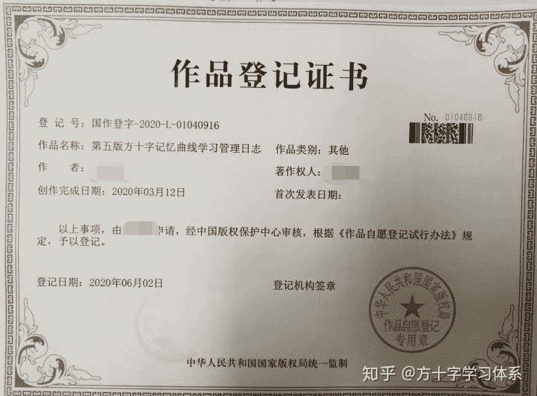

已申请国家版权了噢，诸邪退散~

**注意噢，虽然后面的说明很详细，但你操作起来就会发现，真的非常非常非常非常简单，要是觉得操作复杂你可以顺着网线来打我~**

第五版学习管理日志主要有3个功能：

**（1）学习记录**

**（2）学习计划**

**（3）按照艾宾浩斯记忆曲线进行复习管理**

后文将逐一讲解。

## **1.如何做学习记录**

做学习记录是一个操作极度简单，**有手就行**，但效果极佳的学习方法。

所谓学习记录，就是像记日志一样，记录自己哪段时间都学了什么。

简简单单的学习记录，你会发现你的学习计划，复习计划都将有章可循。每天的学习记录也会让你成就感max。你会感觉到你对学习的认识都变得更加深刻了。

本日志采取了创新的方式进行学习记录，效率更高，效果更好，具体操作如下：

**（1）记录日期**

在左上角“Today”处记录当天的日期。首次可从任意日期开始使用本日志。可以且推荐提前填入后续日期。

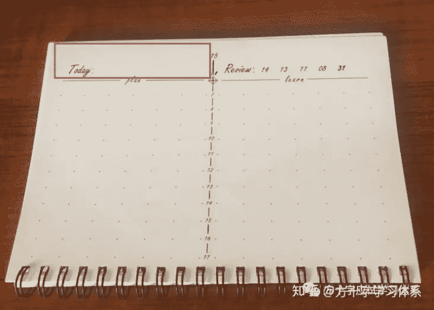

注意，**日期需要连续记录**，不得中断。即使某几天没有学习，学习记录为空，也需要将日期记录在对应页中。否则会造成后续的复习出现混乱。

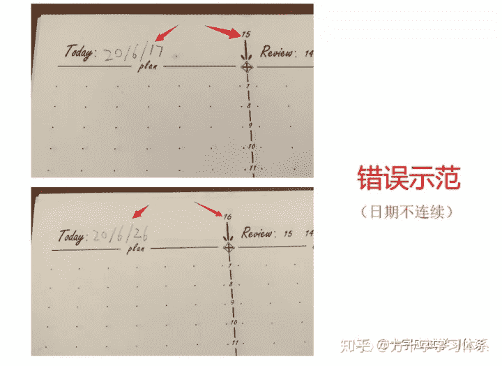

错误示范：第15页记录的日期为“2020年6月17日”，第16页记录的日期为“2020年6月26日”

**（2）记录学习时间**

记录自己具体的学习时间可以为后续的复盘，预测自己的学习进度等学习管理环节提供有力的帮助。

除了用数字记录时间之外，本日志兼容一种特殊的学习时间记录法：**箭线时间记录法**。

该方法具有记录速度更快，占用记录空间更少，且能更直观的看出学习时长与分布等优点，因此下文着重介绍该方法如何操作。

如下图所示，本日志页的基本结构如下：

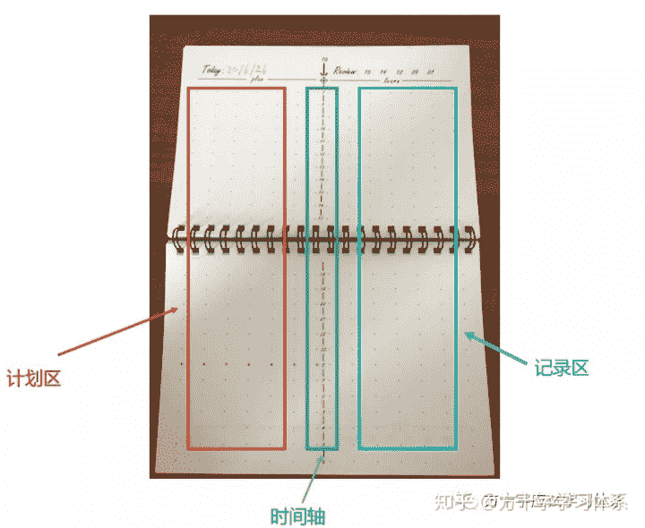

右半面，上方单词“learn”所对应的是**记录区，**用于做学习记录。

左半面，上方单词“plan”所对应的是**计划区，**用于制定学习计划。

中间，带有数字刻度的竖线是一条**时间轴**，每个数字都代表一天中某个小时。

在记录区，时间轴上每一个数字都对应着一排7个点，每个点都代表一个时间刻度，相邻两点时间间隔为10分钟，**看下图就明白了**。

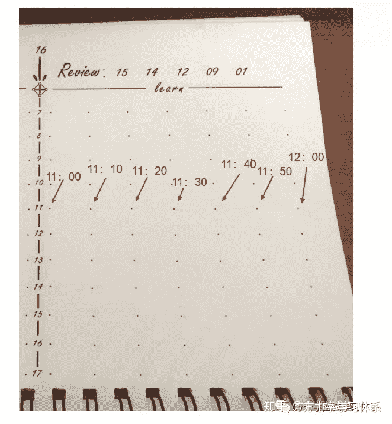

计划区与之相同。

因此，通过绘制两点之间的箭线，即可记录时间。

比如你想记录“8：40~9：10”，便可以按下图所示进行记录：

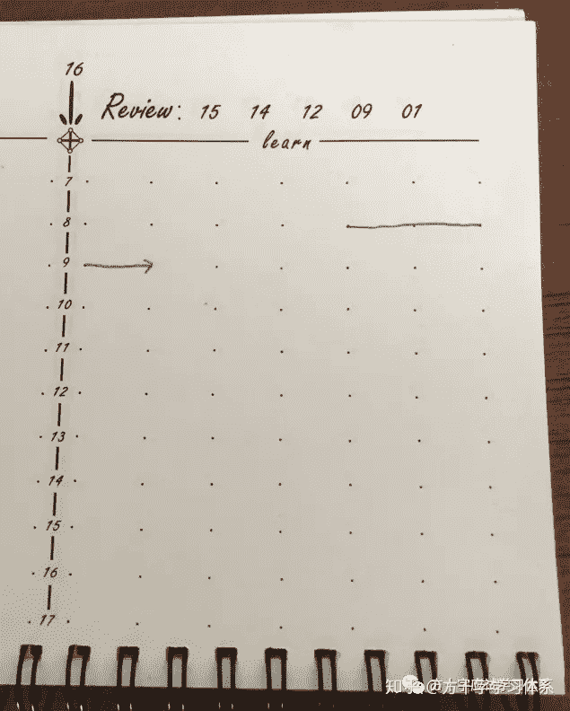

8：40~9：10

如果需要进行不是整10分钟的时间记录，只需要在两点间进行大致估算，确定箭线的始终即可（过于精确的时间记录意义不大）。

比如你想记录“19：13~19：36”，便可按下图所示进行记录：

对于“19：13”，只需要大致估算19：10与19：20所对应的的两点之间的大致位置即可。“19：36”同理

**小窍门**：可以在日志页上方提前写好黑点对应的时间刻度，便于在绘制时间箭线时进行查询，避免自己数点。如图红框处所示：

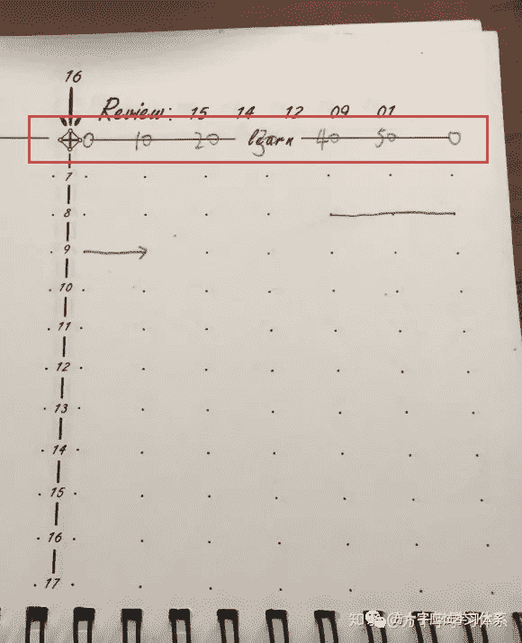

**（3）记录学习内容**

不同于学习笔记，学习日志无需具体记录学习内容，只需按照自己能看懂的方式记录某段时间所学内容的出处即可，以便复习和复盘的时候知道自己这段时间都学了什么，并可以通过日志记录找到对应的知识内容即可。

举例说明：比如你在2020年6月26号的8：40~9：10，在一本俗称《绿宝书》的英语单词书中，从第108页第3个单词学到了第120页的第6个单词。

那么你可以按照下图方式进行记录，或者采取你自己可以看懂的任何方式，只要之后能看懂，找得到对应的学习内容就可以。

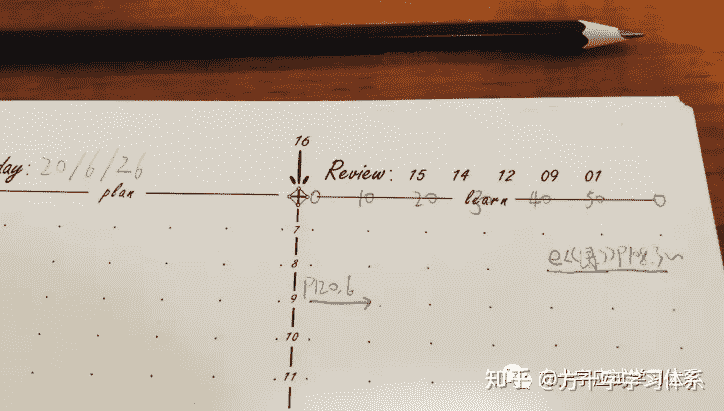

“e”代表“英语”，《绿》代表《绿宝书》，“P108，3”代表108页第三个单词，文字下方箭线按照上文所示方法记录时间

注意，这些记录是后续能够采取艾宾浩斯记忆曲线进行复习的重要前提。

如果想要使用该日志本按照艾宾浩斯记忆曲线进行复习管理，则需要在学习记录中区分出当天**学习新知识所产生的学习记录**，以及当天**复习所产生的学习记录**。

具体的区分方法可以采用不同颜色的笔，或者箭线的不同进行区分。也可以自行采取任何其他有效方式进行区分。

如下图所示，直线代表学习新知识产生的学习记录，波浪线代表复习记录：

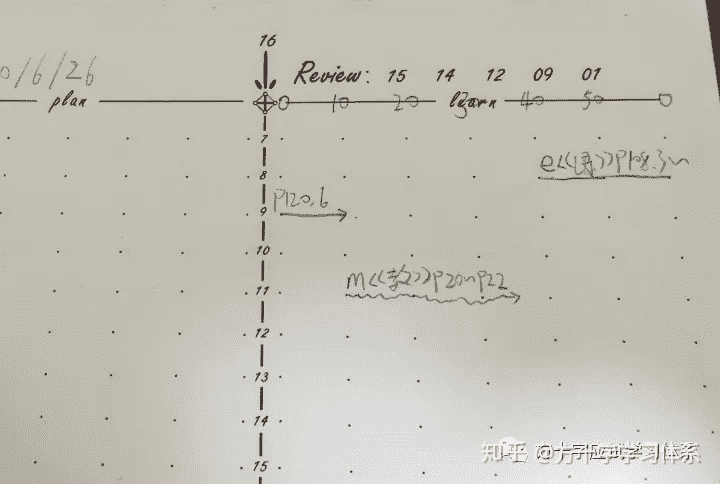

直箭线上为新知识的学习记录，波浪箭线上为复习记录。

除此之外，也可以采取特殊标记来区分重点内容或无需复习的内容等，学生可以按照自己的需求任意操作。

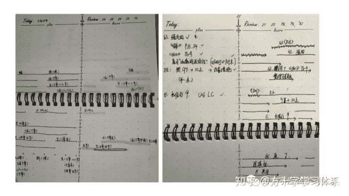

深度用户的对学习日志本的使用情况

深度用户的对学习日志本的使用情况

## **2.如何做学习计划**

本日志从实用的角度出发，兼容多种制定学习计划方式，学生可以根据自己的需求自行制定。

下文试举几例，来演示如何采用本日志制定方式不同的学习计划。

**（1）清单式计划**

如图所示，直接罗列即可：

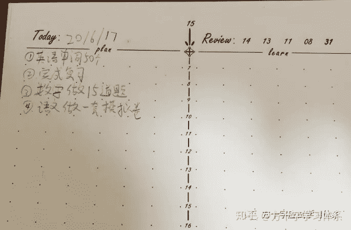

**（2）分类式计划**

比如学生采取的是经典的四象限法做计划，即将所计划的事分为“重要且紧急”，“重要但不紧急”，“紧急但不重要”，“不重要不紧急”。那么学生可以事先用字母代替分类，之后按照“清单式计划”进行计划即可。

比如某学生按照如下方式赋予字母以分类意义：

*   A：重要且紧急
*   B：重要且不紧急
*   C：紧急且不重要
*   D：不重要且不紧急

则计划形式可能是如下图所示，或者其他任何有效的形式：

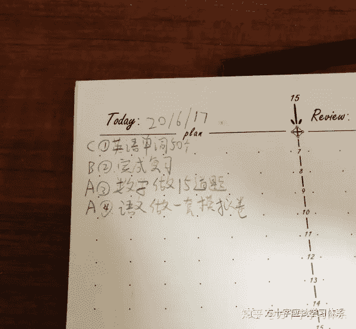

**（3）优先重点法与艾维.利时间管理法**

眼尖的你一定已经发现了计划区偏下方有一排点是不一样的。由这排特殊点所区隔的计划区可以用来列出当日的重点计划。

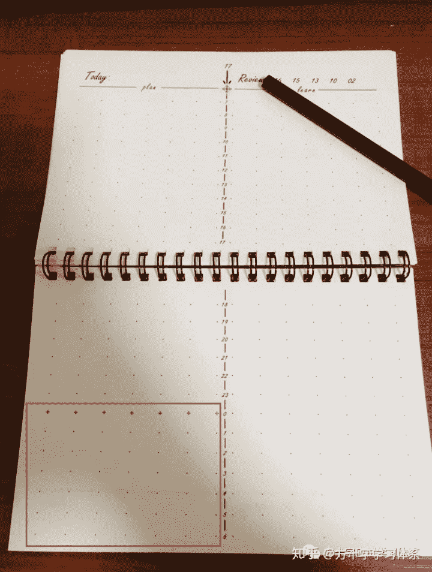

细数就可以发现，这个区域有6行，对应着艾维.利时间管理法中的“列出6件最重要的事”。

当然，此区域也可以作为它用，任凭学生按需操作。

**（4）精细计划**

精细计划，就是类似具体到“几点几分到几点几分，我要去做什么/学什么”这样的计划。

采取本日志，可以采取和类似上文学习记录的方式进行精细计划。

比如你计划在19：00~19：20背教材上的单词，便可以按照下图方式制定计划：

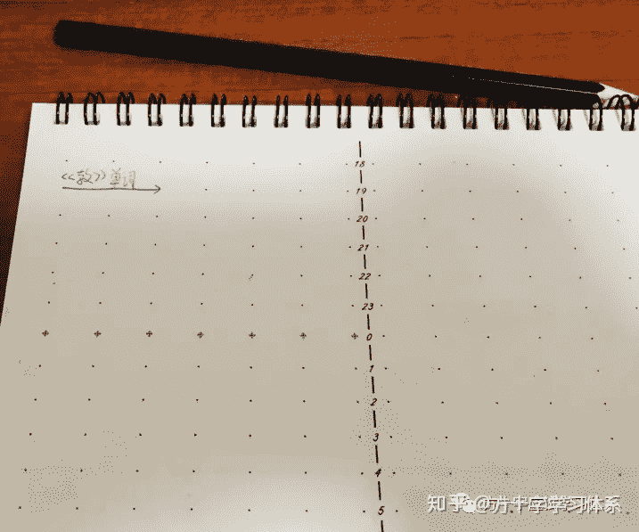

除上述几种计划方式外，该日志本也兼容上述计划方式的组合，以及其他多种计划方式。除日计划外，在日志本前几页也设置了月计划页与周计划页。

总之，学生可以按照科学的，适合自己的方式，采取该日志本进行计划的灵活制定。而每一页的计划区与记录区的相邻，也方便学生对计划与实际情况进行比对，从而对后续学习进行有效的优化。

## **3.如何按照艾宾浩斯记忆曲线进行复习管理**

**你是否感觉明明已经学会了，却很快就忘记？**

**你想牢牢的把知识记住吗？**

德国心理学家艾宾浩斯在对记忆的研究中发现，遗忘在学习之后立即开始，且遗忘的进程先快后慢。

换句话说，对于绝大多数的知识内容，只学一次是不够的，必须要加以复习。否则你头一次学的再好，也会慢慢的忘光。

但复习不是胡乱来的，否则就会效果就如同下图紫线。若想有效的保持并实现对知识的长期记忆，则需要在首次学习后，按照先密后疏的频率对相关的知识内容进行复习。

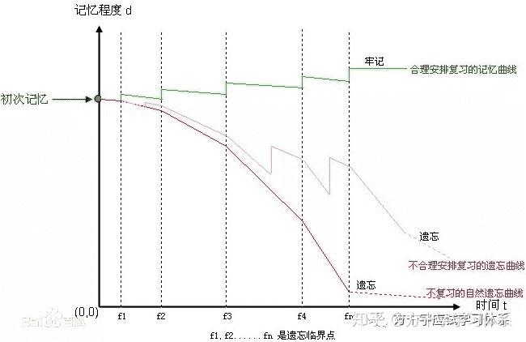

若想实现长期记忆，目前公认的一个方式为：首次学习后，在第1天，第2天，第4天，第7天，第15天对相关的知识内容进行有效的复习。

那么如何才能采取这个方式对各类知识内容进行复习呢？这便是本日志的一大特色功能。

本日志采取创新的方式实现了按科学频率进行复习，相比于市面上的“表格法”等更为方便，具体操作如下：

**（1）如何复习**

具体操作非常非常非常简单。

如图所示，日志页的右上方“Review”处有5个数字，代表着5个页码：

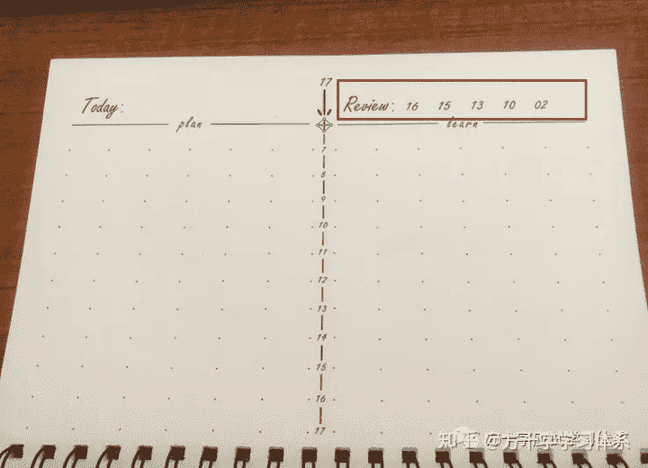

你只需要按照这5个页码翻到对应的页数，这些页数记录区的“新知识学习记录”就是你今天需要复习的内容。

就是这么简单。

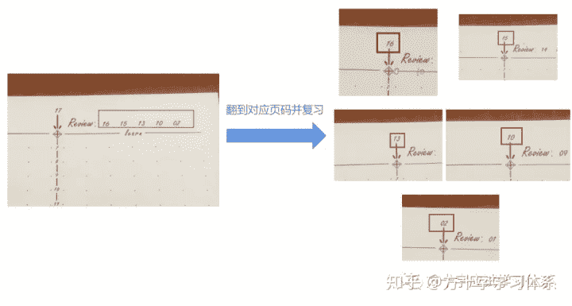

**（2）采取该方法复习需要注意的地方**

（1）对应页数中的复习记录无需复习，只需要复习对应页数中，那天所学的新知识。

这也是为什么要在学习记录中区分出当天**学习新知识所产生的学习记录**，以及当天**复习所产生的学习记录**。

（2）5个页码中，若出现粗体的页码，则代表你所使用的上一本日志中的对应页码。

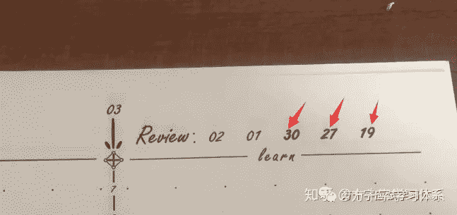

箭头所示页码字体与另外两个不同，为粗体页码，代表你所使用的上一本日志中对应页码

（3）对于首次使用本日志的同学来说，不必对使用日志之前的内容按照此方法进行复习，因为你没有对应的学习记录，无法复习。

（4）若当天未完成复习，推荐你把当天未完成的复习任务纳入明天的学习计划。

如果今天未完成的复习任务与明天的复习任务出现了重合，则可以直接合并。

（5）若想避免（4）所示操作造成复习任务的大量堆积，推荐学生采取“优先复习”的学习策略，即“完成复习任务后再学习新知识，不完成复习不学新知识”。具体原理此处不做详解。

（6）（骚操作）若存在长时间未完成的复习任务，或想要重置复习周期，推荐你在做学习记录的时候，把对应的学习过程记录为“新知识的学习记录”，而非“复习记录”。这样，你便可以对相应的知识内容进行新一轮的复习。

（7）（骚操作）若想控制整体的复习次数，比如只想对1，2，4天后的内容进行复习，则可以把“7天后”，“15天后”所对应的页码划去，如下图示例：

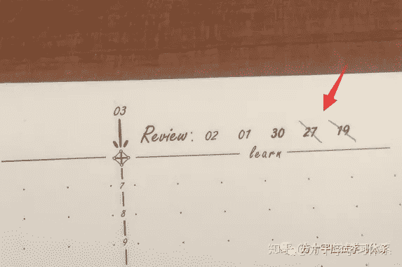

而若想对某一条学习记录控制复习次数，则可以通过“画正字”的方式实现。即每复习一次，就在对应的记录处画一个正字。画够了对应的次数，即停止对该条记录的复习。

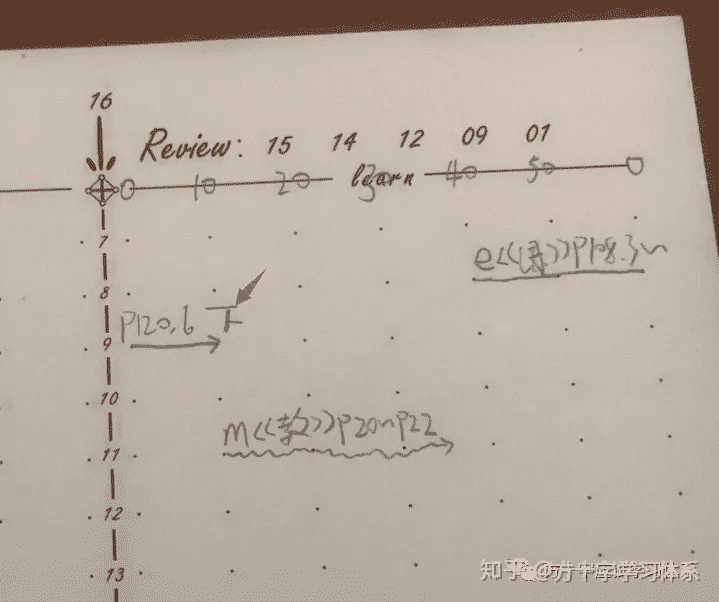

红色箭头所指为“正”字

## **4.其他功能与操作**

**（1）月/周计划与总结**

该日志本前几页是月/周学习计划册，专门用来制定月计划，周计划，以及对应的总结。学生可以根据自己的需求对该册进行使用。

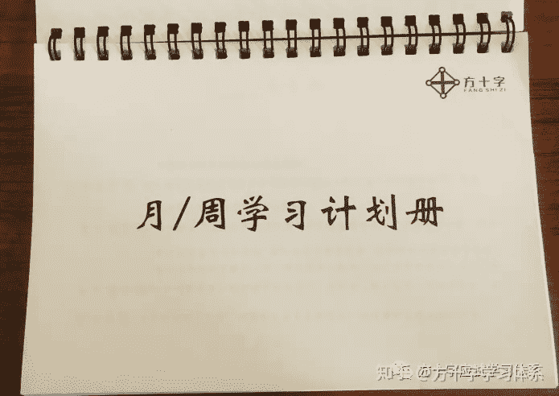

**（2）每日总结**

众所周知，学生是要睡觉的，而学生在睡觉的时候无法做学习记录。

因此，本日志的每一页几乎都会在记录区出现一块空白，对应着学生的睡眠时间。比如学生23：00~6：00是睡眠时间，则空白区域大致如下：

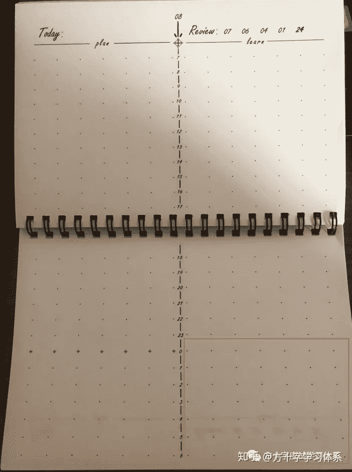

因此，该区域可用来作为每日总结区。当然，也可以根据需求用于其他目的，比如记录今日重点的知识，记录今天的心情，记录今天尚未解决的问题等等。

**（3）标号记录法与便利贴的使用**

如果出现箭线长度不够，或记录空间不足的情况，可以采取标号记录+便利贴的方式进行处理。

举例说明：比如你在20：00~20：10学习了《绿宝书》p108~110页的全部单词，如果直接记录的话，箭线长度可能是不够的，就像这样：

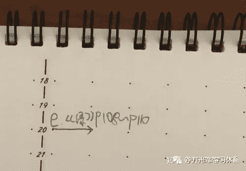

处理方法很简单：你可以另附一个便利贴，将此条记录赋予标号（1），在箭线处记录标号即可，如图所示：

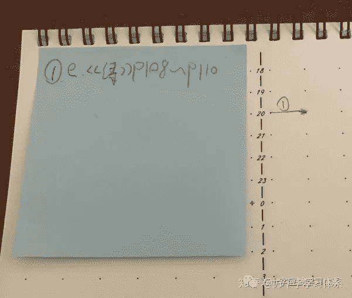

当然，也可以记录在日志任意空白处。上述操作仅供参考。

**（4）别针翻页法**

在实际的使用中，往往需要在当前记录页与复习所需查看的记录页之间频繁翻阅，因此，可以通过“别针翻页法”来让翻页更为迅速，从而节省时间，使本子使用起来更加顺畅。具体操作如下：

比如当前是20页，而接下来你需要复习16页的内容：

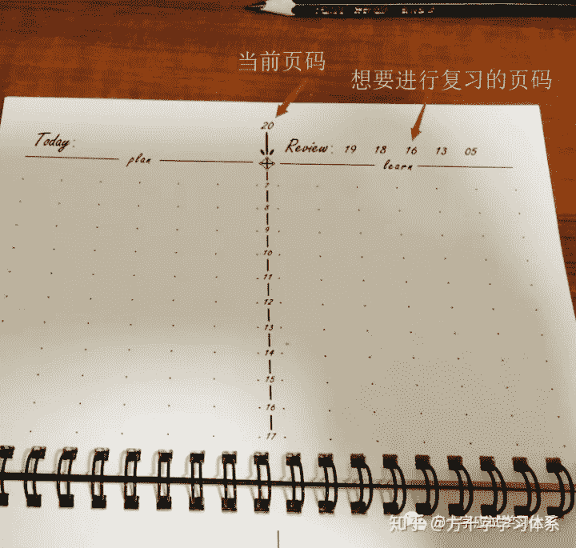

那么接下来，你可以按照下图的方式，使用回形针将纸页别上：

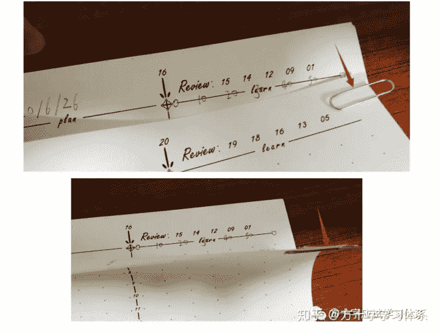

这样即可实现20页与16页之间的快速翻页。

## **5.总结**

本文作为对第五版方十字学习管理日志的使用说明，归为方十字矛盾分析体系——矛盾3——应试学习的工具流中，服从矛盾分析体系所述一切原理。

除上述说明外，该工具仍可能具有其他潜能，有待各位教育参与者在实际的使用中不断发掘。

若有其他任何问题，欢迎在关注公号，或加入同名社群参与讨论。